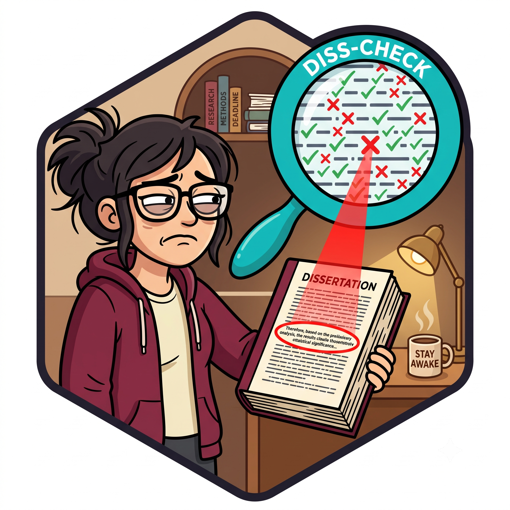

# scholarpress-check



Rust library for automated dissertation formatting validation. PDF in, violations out.

Extracts text, fonts, and layout from PDFs using [pdf_oxide](https://github.com/yfedoseev/pdf_oxide), then runs automated checkers against institution-specific formatting requirements defined in YAML.

Part of the [ScholarPress](https://github.com/scholarpress-workshop) ecosystem. Used by [`scholarpress-cli`](https://github.com/scholarpress-workshop/scholarpress-cli) for the command-line interface and [`scholarpress-publish`](https://github.com/scholarpress-workshop/scholarpress-publish) for automated document generation. Institution specs and test fixtures live in [`scholarpress-catalog`](https://github.com/scholarpress-workshop/scholarpress-catalog).

## Installation

```bash
cargo add scholarpress-check
```

## Usage

### Run all checks on a PDF

```rust
use scholarpress_check::engine::{run_checks, CheckOptions};
use scholarpress_check::spec::load_spec;
use scholarpress_check::report::{build_report, format_text};
use std::path::Path;

let spec = load_spec(Path::new("path/to/spec.yaml"))?;
let results = run_checks(&spec, Path::new("dissertation.pdf"), &CheckOptions::default())?;
let report = build_report(results);
println!("{}", format_text(&report));
```

### Run a single check

```rust
let options = CheckOptions {
    check_id: Some("global_margins".into()),
    ..Default::default()
};
let results = run_checks(&spec, Path::new("dissertation.pdf"), &options)?;
```

### Run a category of checks

```rust
let options = CheckOptions {
    category: Some("typography".into()),
    ..Default::default()
};
let results = run_checks(&spec, Path::new("dissertation.pdf"), &options)?;
```

### JSON output

```rust
use scholarpress_check::report::format_json;

let report = build_report(results);
println!("{}", format_json(&report)?);
```

### Quiet output (failures and errors only)

```rust
use scholarpress_check::report::format_text_quiet;

println!("{}", format_text_quiet(&report));
```

### Direct PDF extraction (without running checks)

```rust
use scholarpress_check::extractor::extract_document;

let doc = extract_document(Path::new("dissertation.pdf"))?;
println!("{doc} pages", doc.pages.len());
```

### Corpus calibration

```rust
use scholarpress_check::calibration::run_calibration;

let report = run_calibration(
    Path::new("spec.yaml"),
    Path::new("corpus/"),
)?;
println!("Systemic failures: {}", report.systemic_fail_count());
```

## Spec format

Institution formatting requirements are defined in YAML. See [`scholarpress-catalog`](https://github.com/scholarpress-workshop/scholarpress-catalog) for complete spec files.

```yaml
institution: Indiana University
source_revision: September 2025

checks:
  - id: global_margins
    category: layout
    checker: margins
    target:
      scope: all_pages
    params:
      top: 1in
      bottom: 1in
      left: 1.25in
      right: 1.25in

  - id: font_size_consistent
    category: typography
    checker: font_size
    target:
      scope: all_pages
    params:
      allowed: ["10pt", "11pt", "12pt"]
      consistent: true

  - id: committee_order
    category: content
    checker: review
    target:
      page: acceptance
    params:
      prompt: Verify chair is listed first
    automatable: false
    review_hint: Check the committee order on the acceptance page
```

## Checker catalog

### Layout
| Checker | What it checks |
|---------|----------------|
| `margins` | Statistical margin-setting compliance (percentile-based) |
| `margin_symmetry` | Per-page left/right margin symmetry |

### Typography
| Checker | What it checks |
|---------|----------------|
| `font_size` | Font size within allowed range, body consistency |
| `font_weight` | Bold/italic usage (with page filter + invert) |
| `font_family` | Font family consistency (semantic exclusions for math/code) |
| `justification` | Left/justified consistency (front matter excluded) |
| `title_page_all_caps` | Title page text in all caps |
| `title_page_clause_centered` | IU boilerplate clause centered |
| `title_page_clause_spacing` | Clause spacing rules |
| `abstract_title_format` | Abstract title formatting |
| `abstract_text_centered` | Abstract body text centering |
| `footnotes_font_consistent` | Footnote font consistency |

### Structure
| Checker | What it checks |
|---------|----------------|
| `section_presence` | Required sections present |
| `section_order` | Sections in correct order |
| `page_numbers_format` | Roman in front matter, Arabic in body |
| `title_page_no_page_number` | Title page has no page number |
| `acceptance_page_number` | Acceptance page numbering |
| `headings_consistent` | Headings use same font as body |
| `new_chapters_new_pages` | Chapters start on new pages |
| `hyperlinks_format` | Hyperlink formatting |
| `cv_no_page_number` | CV page has no page number |
| `references_heading_format` | References heading formatting |
| `cv_heading_format` | CV heading formatting |
| `cv_name_position` | CV name/position formatting |
| `toc_page_numbers_aligned` | TOC page number alignment |
| `toc_no_overhang` | TOC entry overhang |
| `toc_cv_no_dots` | TOC CV entry has no leader dots |

### Content
| Checker | What it checks |
|---------|----------------|
| `boilerplate_match` | Template text with {variable} substitution (70% threshold) |
| `committee_order` | Chair listed first on acceptance page |
| `toc_title_parity` | TOC entries match body chapter headings |
| `copyright_page_format` | Copyright page formatting |
| `abstract_word_count` | Abstract word count |
| `references_font_consistent` | References font consistency |

## Architecture

```
src/
  lib.rs                # Public module declarations
  engine.rs             # CheckOptions, run_checks() — filtering by ID/category
  spec.rs               # InstitutionSpec, CheckDef, load_spec() from YAML
  document.rs           # TextSpan, Page, Document
  extractor.rs          # pdf_oxide extraction: chars → word-level TextSpans
  report.rs             # build_report(), format_text(), format_text_quiet(), format_json()
  calibration.rs        # run_calibration(), CalibrationReport
  checkers/
    mod.rs              # Checker trait, Status, EvidenceItem, CheckResult, REGISTRY
    layout.rs           # MarginsChecker, MarginSymmetryChecker
    typography.rs       # FontSizeChecker, FontWeightChecker, FontFamilyChecker, JustificationChecker
    structure.rs        # SectionPresence, SectionOrder, page numbers, headings, chapters, CV, hyperlinks
    content.rs          # BoilerplateMatch, CommitteeOrder, TocTitleParity, HumanReview
    title_page.rs       # TitlePageAllCaps, TitlePageClauseCentered, TitlePageClauseSpacing
    optional_pages.rs   # CopyrightPageFormat
    footnotes.rs        # FootnotesFontChecker
    sections.rs         # ReferencesFont, ReferencesHeading, CvHeading, CvNamePosition, abstract checkers
    toc_details.rs      # TocPageNumbersAligned, TocNoOverhang, TocCvNoDots
```

## Development

```bash
cargo build --release
cargo test
cargo clippy -- -D warnings
cargo fmt --check
```

## License

MIT
